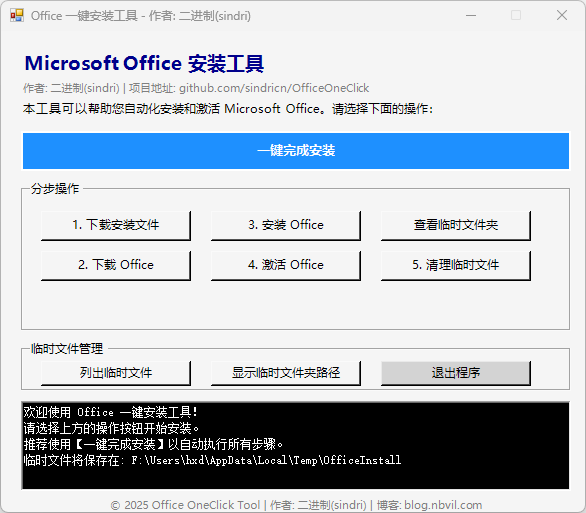

# 🎯 OfficeOneClick

Microsoft Office 一键安装和激活工具，提供简单易用的图形界面。



## ✨ 简介

OfficeOneClick 是一个基于 PowerShell 的图形化安装工具，帮助 Windows 用户一键完成 Microsoft Office 的下载、安装与激活流程。无需手动操作安装包，适合新手和希望高效部署 Office 的用户使用。

- 🧰 支持完整自动流程或手动分步执行

- ⚙️ 使用 Microsoft 官方部署工具

- 🔐 通过 KMS 自动激活

- 🧹 安装完成后可自动清理临时文件

## 🚀 功能特色

- ✅ 一键完成 Office 下载、安装与激活

- ✅ 提供分步骤操作选项

- ✅ 自动下载部署工具与安装包

- ✅ 自动连接 KMS 激活服务器

- ✅ 支持临时文件清理、日志输出等附加功能


## 📚 教程指南

- 📖 文章教程：[博客文章]()
- 🎬 视频教程：
  - B站：[B站视频]()
  - YouTube：[YouTube视频]()


## ⚡ 快速开始

以管理员身份运行 PowerShell，然后执行以下命令即可启动图形界面：

```powershell
irm https://raw.githubusercontent.com/sindricn/OfficeOneClick/main/install.ps1 | iex
```

## 💡 默认安装说明

- Office 版本：Microsoft Office LTSC 专业增强版 2024

- 安装语言：简体中文（zh-CN）

- 默认组件：Word、Excel、PowerPoint

## ⚙️ 自定义 Office 安装版本与内容

如需更换 Office 版本、安装语言或添加/移除组件（如 Access、Publisher 等），可自行修改 config.xml 配置文件。

推荐使用 Microsoft 官方配置工具生成配置文件：

### 🛠 Office 版本自定义工具：
- 👉 https://config.office.com/deploymentsettings

将生成的配置文件替换项目根目录中的 config.xml 文件后，重新执行脚本即可根据自定义配置进行安装。

## ⚠️ 免责声明

本工具仅供学习与研究用途，请勿用于任何商业用途。

请确保使用本工具时遵守 Microsoft 的软件许可条款。

## 💬 支持与交流

如果你有任何问题或建议，可以：

- 提交 [Issue](https://github.com/sindricn/OfficeOneClick/issues)

## ☕ 赞赏支持
如果你觉得这个项目对你有帮助，可以通过以下方式支持我：


